## 概述：

本次刷入的固件为恩山237大佬的 **0702-cudy immortalwrt 24.10闭源无线大功率固件**。在刷机过程中涉及的全部固件将统一打包并上传至网盘，以便大家后续查阅和下载。同时，文章中使用到的**所有项目地址**和本文作者**整理好的所有固件包**均会在文章底部的**参考连接**部分进行整理与列出。

## 一、刷入过度包

#### 1.下载OpenWrt的升级镜像包（cudy_tr3000-v1-sysupgrade.bin）

[OpenWrt Wiki\] Table of Hardware: Firmware downloads](https://openwrt.org/toh/views/toh_fwdownload)

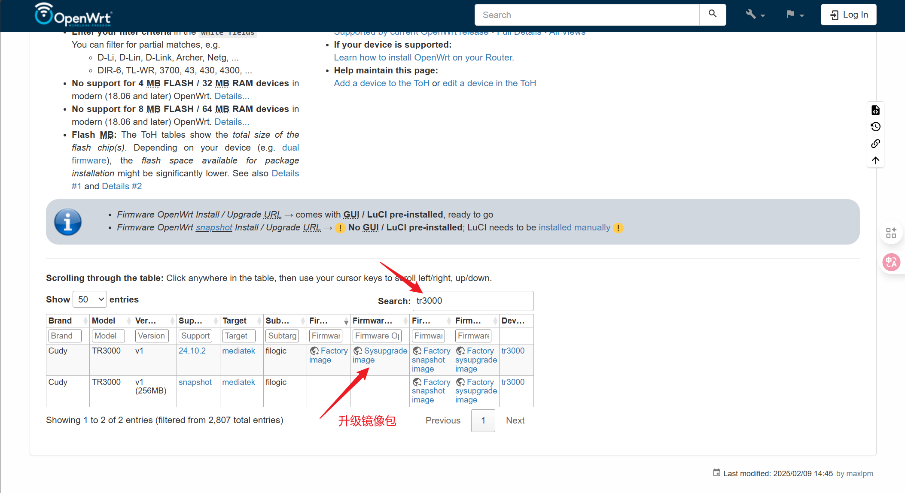

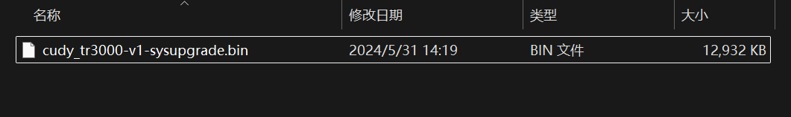

#### 2.进入路由器后台刷入过度包

登录原厂后台后，进入 **高级设置** 页面，向下滚动至页面底部，找到 **固件升级** 选项。选择之前下载好的升级固件并开始刷写，系统将在刷写完成后自动重启。若过程中弹出提示“连接已断开，请检查是否通过有线或无线网络连接到路由器”，则表明固件已成功刷入。


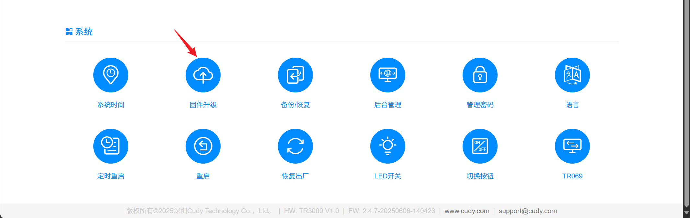

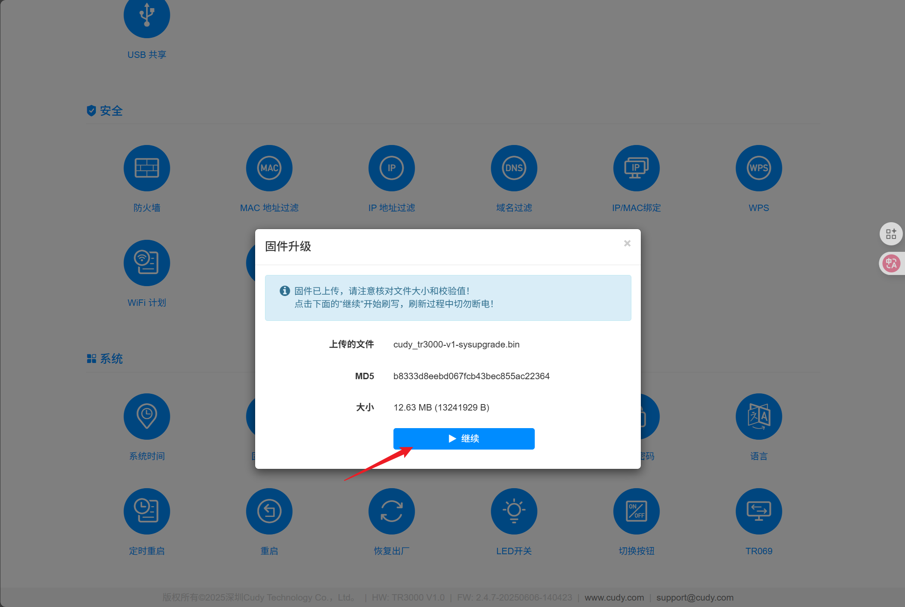

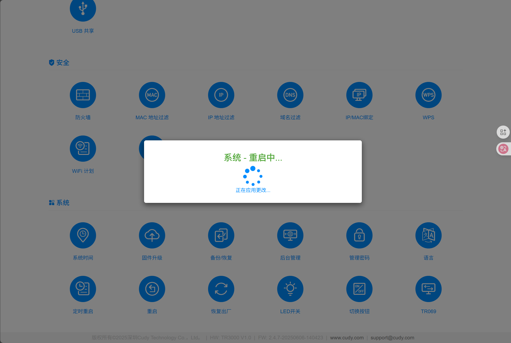

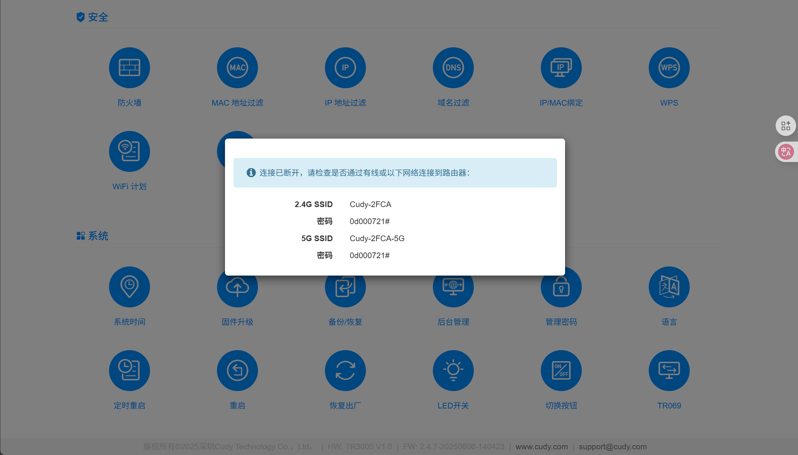

#### 3.登入刷写好的后台进行验证

在浏览器输入 192.168.1.1 登入后台进行验证。密码为空直接点击登入


## 二、备份 FIP 分区

注意：需要刷回原厂固件的记得先备份 FIP 分区 ！

点击系统，选择备份与升级，找到保存mtdblook 内容，选择为FIP保存下载

## 三、刷入升级固件

在当前界⾯中选择：系统->备份与升级，在“刷写新的固件“选项 中，上传您下载的OpenWrt固件。

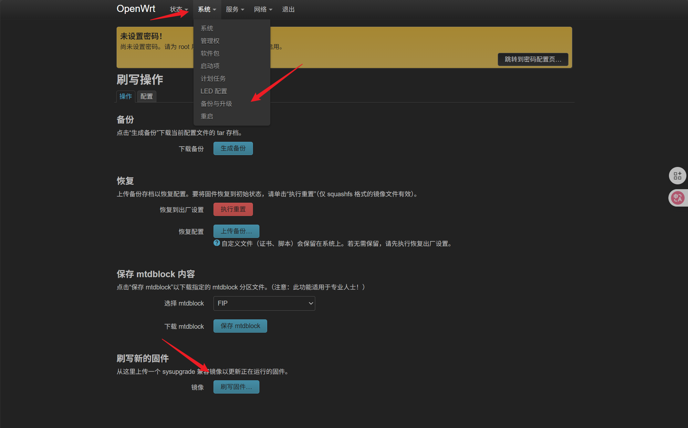

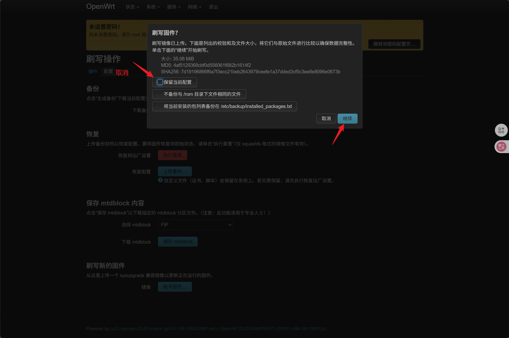


## 四、刷入**uboot**

#### 1、上传并输入uboot

升级完成后，页面会自动刷新。默认登录密码为 **`password`**。进入主页后，依次选择：**系统 → 文件传输**，上传 U-Boot 文件。随后进入 **系统 → TTYD 终端**，使用以下账户信息登录：

- 用户名：`root`
- 密码：`password`

登录成功后，执行下列命令完成 U-Boot 的刷写操作。

```
cd /tmp/upload/

mtd write mt7981_cudy_tr3000-mod-u-boot.fip FIP
```

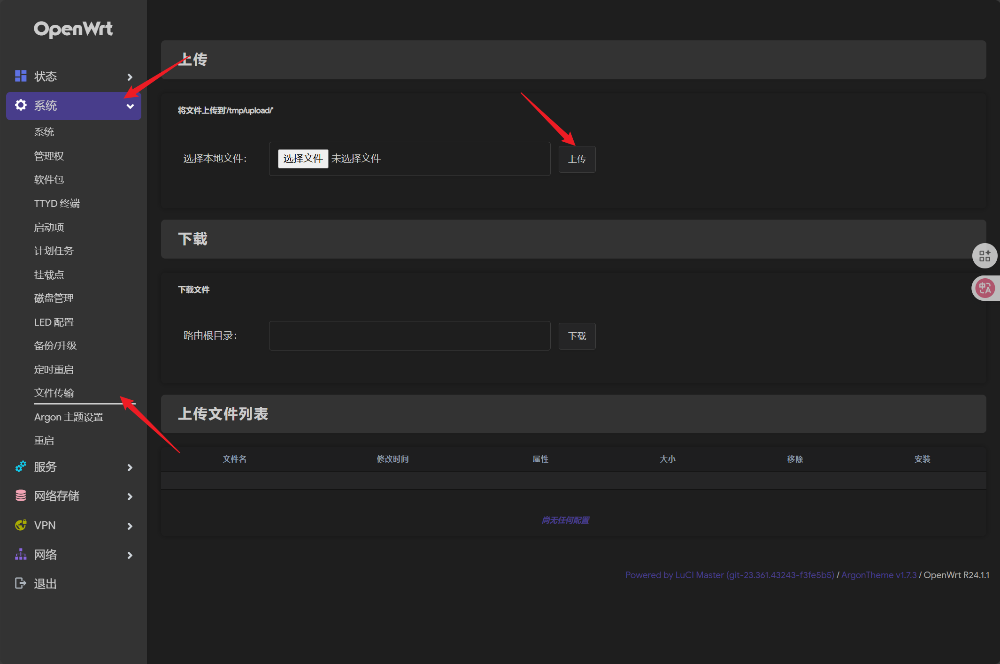

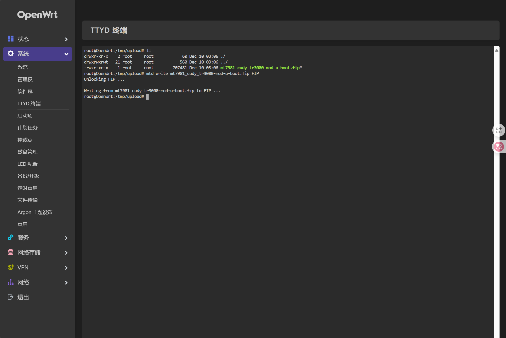

#### 2、修改网卡地址，重启路由器

将以太网网卡的 IP 地址设置为 **192.168.1.2**，子网掩码设置为 **255.255.255.0**，并确保电脑的首选网口已连接至路由器的 **LAN 口**。
拔掉路由器电源，按住 **Reset** 按键不放的同时接通电源，保持约 10 秒后松开，即可进入下一步操作。

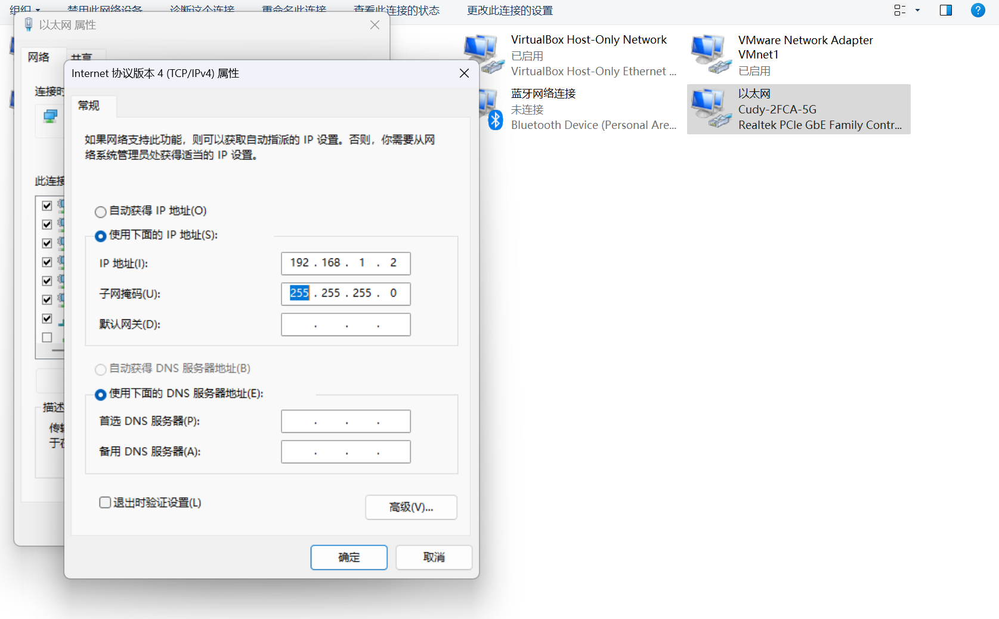

3、在浏览器地址栏输入 **192.168.1.1**，进入 U-Boot 后台管理界面。现在你就可以选择你需要输入的大分区固件了（112M）

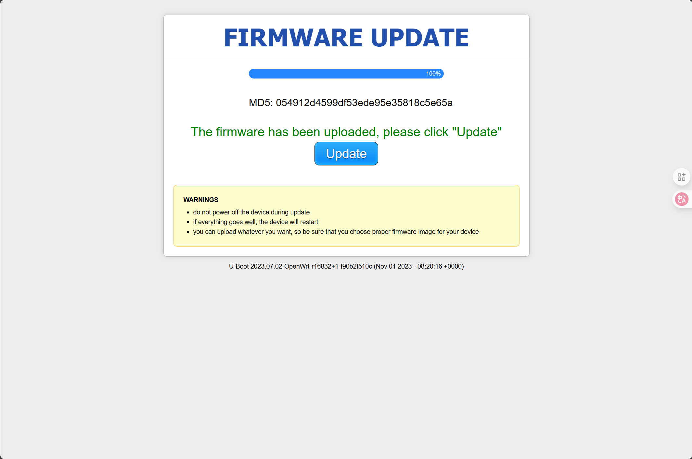


## 五、刷入immortalwrt 24.10闭源无线大功率固件

在浏览器地址栏输入 **192.168.1.1**，进入 U-Boot 后台管理界面。选择上传固件并开始刷写，耐心等待路由器完成刷机过程。
刷机完成后，将以太网网卡的 IP 地址调整为自动获取IP地址模式（DHCP），随后在浏览器中访问 **192.168.6.1**，即可进入路由器后台管理页面。

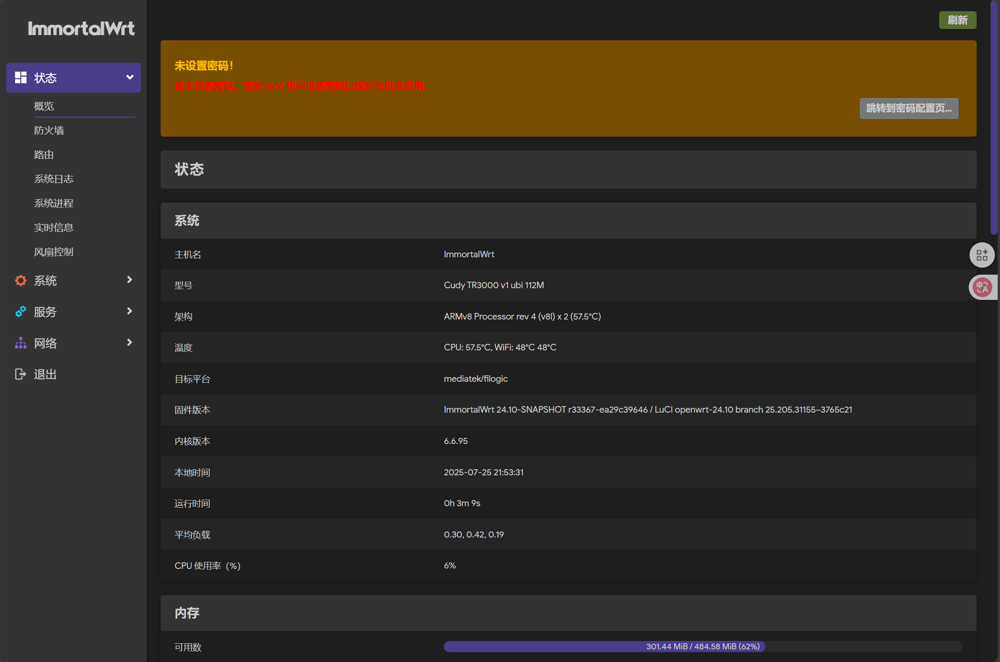

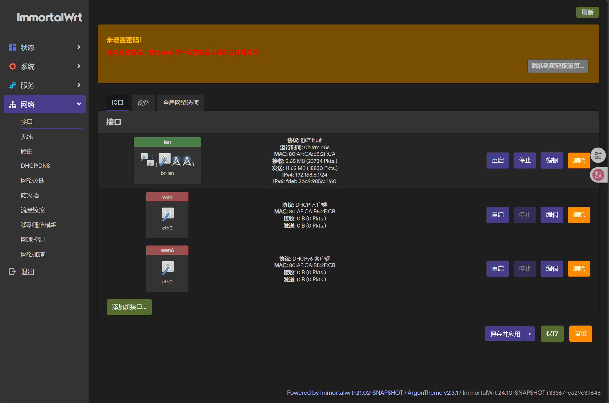

## 参考链接

本教程刷入固件地址：[cudy immortalwrt 24.10闭源无线大功率固件-OPENWRT专版-恩山无线论坛 - Powered by Discuz!](https://www.right.com.cn/forum/thread-8421483-1-1.html)

Cudy TR3000 的情报收集：[折腾 Cudy TR3000 的情报收集-OPENWRT专版-恩山无线论坛 - Powered by Discuz!](https://www.right.com.cn/forum/thread-8411618-1-1.html)

恩山暗云大佬的刷机教程：[Cudy TR3000 刷机教程指北-OPENWRT专版-恩山无线论坛 - Powered by Discuz!](https://www.right.com.cn/forum/thread-8410353-1-1.html)

B站参考教程（讲的很清晰，还原会原厂系统看一下这期视频中的介绍）：[随意刷OpenWrt,超高性比便携路由器Cudy TR3000刷机/刷回原厂教程分享,一个视频全搞定!_哔哩哔哩_bilibili](https://www.bilibili.com/video/BV13HkdYsEn6/?spm_id_from=333.1007.top_right_bar_window_history.content.click&vd_source=fb8eb6dfcbd71299a284e8d99e7ec589)

文章作者整理的刷机固件包：

- 百度：https://pan.baidu.com/s/1KPLpyDUZvPhR3L3u6Og0lg 提取码: 0721 
- 夸克：https://pan.quark.cn/s/79b3013dd1ed 提取码：Bsc3
- 123：https://www.123912.com/s/tdpFjv-SkXw3 提取码:0d00

## 结尾：

写这篇文章也是临时起意，主要是想记录一下折腾的过程，留做存档。作为为新手，在刷机过程中发现相关资料比较分散，缺少完整的图文教程，因此尽量把自己的经历写得详细一些，供大家参考。第一次尝试写这种教程类的文章，难免有不足，欢迎大家在评论区指正。
