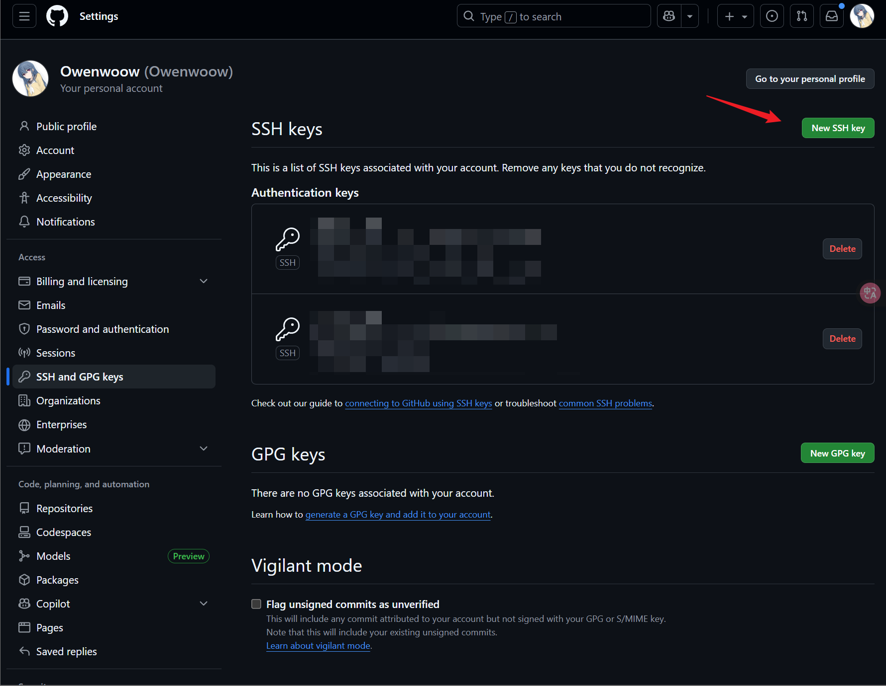
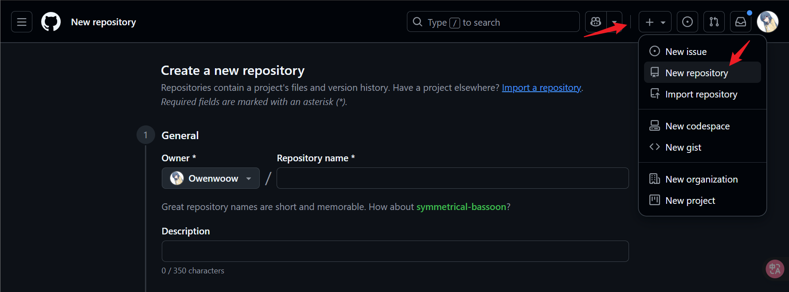
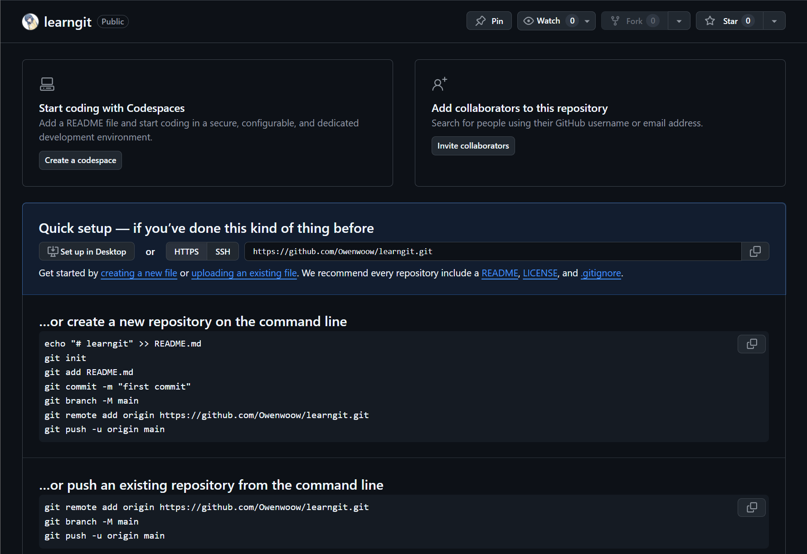
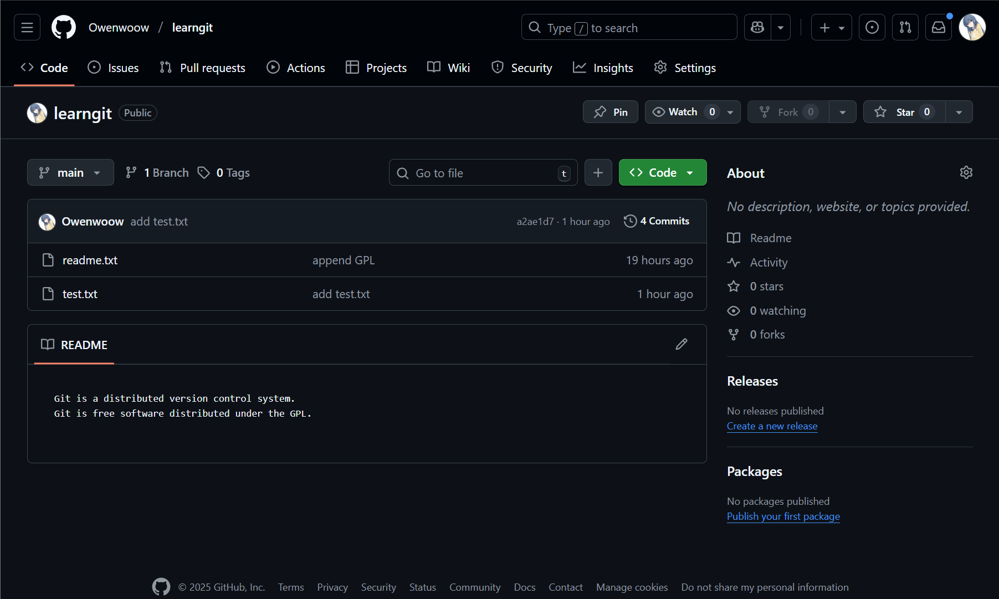
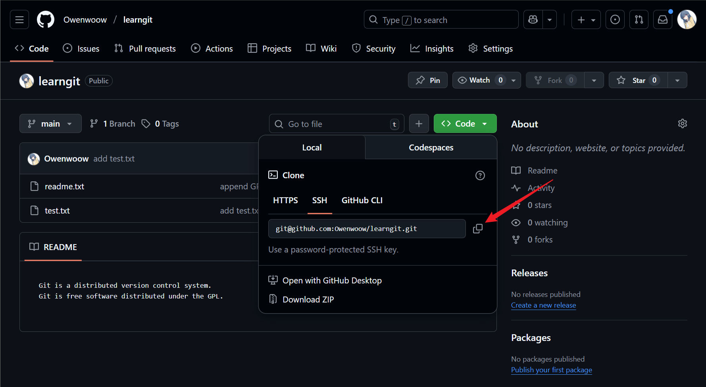

## 1.Git介绍

### 1.1.Git是什么

Git是目前世界上最先进的分布式版本控制系统（没有之一）。

### 1.2.分布式与集中式

SVN是**集中式**版本控制系统，版本库是集中放在中央服务器的，而干活的时候，用的都是自己的电脑，所以首先要从中央服务器哪里得到最新的版本，然后干活，干完后，需要把自己做完的活推送到中央服务器。集中式版本控制系统是必须联网才能工作，如果在局域网还可以，带宽够大，速度够快，如果在互联网下，如果网速慢的话，就纳闷了。

Git是**分布式**版本控制系统，那么它就没有中央服务器的，每个人的电脑就是一个完整的版本库，这样，工作的时候就不需要联网了，因为版本都是在自己的电脑上。既然每个人的电脑都有一个完整的版本库，那多个人如何协作呢？比如说自己在电脑上改了文件A，其他人也在电脑上改了文件A，这时，你们两之间只需把各自的修改推送给对方，就可以互相看到对方的修改了。


## 2.安装Git

### 2.1.在Linux上安装

首先，你可以试着输入`git`，看看系统有没有安装Git：

```bash
$ git
The program 'git' is currently not installed. You can install it by typing:
sudo apt-get install git
```

像上面的命令，有很多Linux会友好地告诉你Git没有安装，还会告诉你如何安装Git。

如果你碰巧用Debian或Ubuntu Linux，通过一条`sudo apt install git`就可以直接完成Git的安装，非常简单。

如果是其他Linux版本，请参考发行版说明，例如，RedHat Linux可以通过命令`sudo yum install git`安装。没有包管理器的发行版可以自行[下载源码](https://github.com/git/git)编译安装，仅适合老鸟。

### 2.2.在Windows上安装

直接从Git官网直接[下载安装程序](https://git-scm.com/downloads/win)，然后按默认选项安装即可。安装完成后，在命令行中输入git，返回信息未安装成功

### 2.3.配置Git

安装好Git后，还需要最后一步设置，在命令行输入：

```git
git config --global user.name "Your Name"
git config --global user.email "email@example.com"
```

查看`git config` 配置信息：

```
git config --list
```

> 注意`git config`命令的`--global`参数为全局参数，表示你这台机器上所有的Git仓库都会使用这个配置，当然也可以对某个仓库指定不同的用户名和Email地址。

Git 的配置优先级：

1. **system**（系统级）
2. **global**（当前用户级）
3. **local**（当前仓库级，优先级最高）


## 3.创建版本库

什么是版本库呢？版本库又名仓库(Repository)，可以理解为一个目录，在这个目录中所有的文件都会被Git管理起来，每个文件的改动，都可以被Git跟踪，或者可以还原。

### 3.1.创建仓库

```
git init <目录>
```

### 3.2.克隆仓库

```
git clone <仓库地址>
```


## 4.工作区和文件状态

Git有三个主要区域：工作区、暂存区和本地仓库，它们定义了文件的不同状态。文件在工作区中修改，可以通过 `git add` 命令将其添加到暂存区，最后通过`git commit`将暂存区的修改提交到本地仓库。 

### 4.1.文件状态

- **未跟踪（untracked）**: Git仓库尚未管理的文件，通常是新添加的文件。
- **已修改（modified）**: 文件已被修改但尚未添加到暂存区。
- **已暂存（staged）**: 文件已经被添加到暂存区，并已包含在下一次提交的快照中。
- **已提交（committed）**: 文件已被永久保存在本地仓库中。 

### 4.2.工作区域

- **工作区 (Working Directory)**: 你直接进行编辑和修改的项目文件所在地。
- **暂存区 (Staging Area)**: 一个中间区域，用于存放你打算在下一次提交时包含的文件列表。
- **本地仓库 (Repository)**: 存储了所有已提交版本的数据的区域，也就是 `.git` 目录。 

### 4.3.查看暂存区中的内容

```
git ls-files
```


## 5.添加和提交文件

### 5.1.常用命令

#### 1）添加文件

```
git add <file>
```

#### 2）提交文件

```
git commit -m <message>
```

#### 3）查看仓库状态

```
git status
```

#### 4）查看文件差异

```
git diff <file>
```

#### 5）查看提交记录

```
git log 	# 查看提交记录
git log --oneline	# 查看简洁的提交记录
git log --pretty=oneline
```


## 6. 版本回退

在Git中，用`HEAD`表示当前版本,上一个版本就是`HEAD^`，上上一个版本就是`HEAD^^`，当然往上100个版本写100个`^`比较容易数不过来，所以写成`HEAD~100`。

```
$ git reset --hard HEAD^
HEAD is now at e475afc add distributed
```

查看历史操作，使用 `git reset --hard commit id`  回退到之前的版本。

```
$ git reflog
90244a0 (HEAD -> master) HEAD@{0}: reset: moving to HEAD^
7c524f7 HEAD@{1}: commit: append GPL
90244a0 (HEAD -> master) HEAD@{2}: commit: add distributed
3730607 HEAD@{3}: commit (initial): wrote a readme file
```

### 6.1.工作区和暂存区

**工作区**（Working Directory）：就是你在电脑里能看到的目录，比如我的`learngit`文件夹就是一个工作区。

**暂存区**：在工作区的隐藏目录 `.git` 中, 存放了当前仓库的版本库，版本库中最重要的就是称为**stage**（或者叫index）的**暂存区**  ，提交的文件会先被放入到暂存区中，在提交是会被一次性提交。

### 6.2.撤销修改

`git checkout -- <file>` 可以丢弃工作区的修改。其中分为两种情况：一种是 `file` 在修改前没有没存放到暂存区中，撤销后文件回到上个版本。另一种是 `file` 已经添加到暂存区后，又进行了修改，撤销后会回退到和暂存区状态一样的版本。

```
$ git checkout -- readme.txt
```

当已经将错误的修改提交到暂存区时该如何修改，我们可以回退到现在的版本即可。

```
git reset --hard HEAD
```

### 6.3.版本回退命令总结

- **回退版本**：`git reset --hard <commit ID>`

- **回退到上个版本**：`git reset --hard HEAD^`

- **查看历史操作**：`git reflog`

  


## 7.远程仓库

### 7.1.创建SSH Key

ssh key 通常存放在用户主目录下的 .`ssh` 目录中

```bash
ssh-keygen -t rsa -C "youremail@example.com"
```

创建完成后会在用户主目录下的 .`ssh` 目录中会有`id_rsa`和`id_rsa.pub`两个文件，`id_rsa`是私钥，不能泄露出去，`id_rsa.pub`是公钥，可以放心地告诉任何人。

#### 7.1.1上传公钥给Github

点击你的头像 --> Settings --> SSH and GPG keys --> New SSH key



#### 7.1.2.配置Git强制使用刚才创建的SSH key[选做]

在 `~/.ssh/config` 中写入：

```
Host github.com
    HostName github.com
    User git
    IdentityFile ~/.ssh/id_rsa
    IdentitiesOnly yes
```

#### 7.1.3.测试SSH 能否正常连接

第一次会提示 `Are you sure you want to continue connecting (yes/no)?`，输入 `yes` 后，如果密钥正确并且 GitHub 账号已绑定公钥，会返回类似：

```
PS C:\Users\Owen_W> ssh -T git@github.com
Hi Owenwoow! You've successfully authenticated, but GitHub does not provide shell access.
```

> -T	Disable pseudo-terminal allocation. （不分配伪终端，只进行认证）

### 7.2.添加远程仓库

首先，登陆GitHub，然后，在右上角找到加号点击“New repository”按钮，创建一个新的仓库：



在Repository name填入`learngit`，其他保持默认设置，点击“Create repository”按钮，就成功地创建了一个新的Git仓库：



目前，在GitHub上的这个 `learngit` 仓库还是空的，GitHub告诉我们，可以从这个仓库克隆出新的仓库，也可以把一个已有的本地仓库与之关联，然后，把本地仓库的内容推送到GitHub仓库。

现在，我们根据GitHub的提示，在本地的`learngit`仓库下运行命令：

```
$ git remote add origin https://github.com/Owenwoow/learngit.git
$ git branch -M main
$ git push -u origin main
```

添加后，远程库的名字就是`origin`，这是Git默认的叫法，也可以改成别的，但是`origin`这个名字一看就知道是远程库。然后，就可以把本地库的所有内容推送到远程库上。

```
$ git branch -M main
$ git push -u origin main
```

简单讲解一些这两条参数: 

- `git branch -M main` 将当前分支强制重置为main。

- `git push -u origin main` 这是一个**推送分支到远程仓库并设置 upstream** 的命令。

  - `-u`：为本地分支设置上游（upstream），即在未来使用 `git push`、`git pull` 时不需要再指定 origin main，

  - `origin`：远程仓库的名称（默认）
  - `main`：要推送的分支名称。

如此我们就将本地仓库推送到了Github上，在GitHub页面中看到远程库的内容已经和本地一模一样的内容。



### 7.3.SSH警告

当你第一次使用Git的`clone`或者`push`命令连接GitHub时，会得到一个警告：

```plain
The authenticity of host 'github.com (xx.xx.xx.xx)' can't be established.
RSA key fingerprint is xx.xx.xx.xx.xx.
Are you sure you want to continue connecting (yes/no)?
```

这是因为Git使用SSH连接，而SSH连接在第一次验证GitHub服务器的Key时，需要你确认GitHub的Key的指纹信息是否真的来自GitHub的服务器，输入`yes`回车即可。

Git会输出一个警告，告诉你已经把GitHub的Key添加到本机的一个信任列表里了：

```plain
Warning: Permanently added 'github.com' (RSA) to the list of known hosts.
```

这个警告只会出现一次，后面的操作就不会有任何警告了。

### 7.4.删除远程库

如果添加的时候地址写错了，或者就是想删除远程库，可以用`git remote rm <name>`命令。使用前，建议先用`git remote -v`查看远程库信息：

```plain
$ git remote -v
origin  git@github.com:Owenwoow/learngit.git (fetch)
origin  git@github.com:Owenwoow/learngit.git (push)
```

然后，根据名字删除，比如删除`origin`：

```plain
$ git remote rm origin
```

此处的“删除”其实是解除了本地和远程的绑定关系，并不是物理上删除了远程库。远程库本身并没有任何改动。要真正删除远程库，需要登录到GitHub，在后台页面找到删除按钮再删除。

### 7.5.克隆远程仓库

从远程仓库 `git clone` 下来的仓库**已经自动绑定了远程仓库**，并且默认把远程仓库命名为 `origin`，所有我们只需要输入以下命令即可：

``` 
git clone git@github.com:Owenwoow/learngit.git
```




## 8.分支管理

### 8.1.创建与合并分支

#### 分支的原理

首先我们需要理清Git的存储方式，每次提交，Git都把它们串成一条时间线，这条时间线就是一个分支。截止到目前，只有一条时间线，在Git里，这个分支叫主分支，即`master`分支。`HEAD`严格来说不是指向提交，而是指向`master`，`master`才是指向提交的，所以，`HEAD`指向的就是当前分支。

一开始的时候，`master`分支是一条线，Git用`master`指向最新的提交，再用`HEAD`指向`master`，就能确定当前分支，以及当前分支的提交点：

```
                  HEAD
                    │
                    ▼
                 master
                    │
                    ▼
┌───┐    ┌───┐    ┌───┐
│   │───▶│   │───▶│   │
└───┘    └───┘    └───┘
```

每次提交，`master`分支都会向前移动一步，这样，随着你不断提交，`master`分支的线也越来越长。

当我们创建新的分支，例如`dev`时，Git新建了一个指针叫`dev`，指向`master`相同的提交，再把`HEAD`指向`dev`，就表示当前分支在`dev`上：

```
                 master
                    │
                    ▼
┌───┐    ┌───┐    ┌───┐
│   │───▶│   │───▶│   │
└───┘    └───┘    └───┘
                    ▲
                    │
                   dev
                    ▲
                    │
                  HEAD
```

你看，Git创建一个分支很快，因为除了增加一个`dev`指针，改改`HEAD`的指向，工作区的文件都没有任何变化！

不过，从现在开始，对工作区的修改和提交就是针对`dev`分支了，比如新提交一次后，`dev`指针往前移动一步，而`master`指针不变：

```
                 master
                    │
                    ▼
┌───┐    ┌───┐    ┌───┐    ┌───┐
│   │───▶│   │───▶│   │───▶│   │
└───┘    └───┘    └───┘    └───┘
                             ▲
                             │
                            dev
                             ▲
                             │
                           HEAD
```

假如我们在`dev`上的工作完成了，就可以把`dev`合并到`master`上。Git怎么合并呢？最简单的方法，就是直接把`master`指向`dev`的当前提交，就完成了合并：

```
                           HEAD
                             │
                             ▼
                          master
                             │
                             ▼
┌───┐    ┌───┐    ┌───┐    ┌───┐
│   │───▶│   │───▶│   │───▶│   │
└───┘    └───┘    └───┘    └───┘
                             ▲
                             │
                            dev
```

所以Git合并分支也很快！就改改指针，工作区内容也不变！

合并完分支后，甚至可以删除`dev`分支。删除`dev`分支就是把`dev`指针给删掉，删掉后，我们就剩下了一条`master`分支：

```
                           HEAD
                             │
                             ▼
                          master
                             │
                             ▼
┌───┐    ┌───┐    ┌───┐    ┌───┐
│   │───▶│   │───▶│   │───▶│   │
└───┘    └───┘    └───┘    └───┘
```

#### Git分支管理相关命令:

- **查看分支**：`git branch`
- **创建分支**：`git branch <name>`
- **切换分支**：`git checkout <name>`  /  `git switch <name>`
- **创建+切换分支**：`git checkout -b <name>`  /  `git switch -c <name>`
- **合并某分支到当前分支**：`git merge <name>`
- **删除分支**：`git branch -d <name>`  /  `git checkout -d <name>`

> 注意: 到切换分支使用`git checkout <branch>`，和撤销修改则是`git checkout -- <file>`，同一个命令，有两种作用，确实有点令人迷惑。因此，最新版本的Git提供了新的`git switch`命令来切换分支。

### 8.2.解决冲突

主分支和其他分支都添加了commit的情况下合并会产出异常，git会将两个版本的文件区别添加到文件中你需要手动修改。在这过程中可以使用gti status 来查看冲突文件，修改后重新提交。

用带参数的`git log`也可以看到分支的合并情况：

```
$ git log --graph --pretty=oneline --abbrev-commit
*   3e55018 (HEAD -> main) conflict fixed
|\
| * c2e37d1 (feature1) AND simple
* | cadec8c & simple
|/
* a8bf546 branch test
* 7a66518 (origin/main) hello
* a2ae1d7 add test.txt
* 7c524f7 append GPL
* 90244a0 add distributed
* 3730607 wrote a readme file
```

等待更新...

## 参考文献：

- [简介 - Git教程 - 廖雪峰的官方网站](https://liaoxuefeng.com/books/git/introduction/index.html)

- [【GeekHour】一小时Git教程_哔哩哔哩_bilibili](https://www.bilibili.com/video/BV1HM411377j/?spm_id_from=333.1387.favlist.content.click&vd_source=fb8eb6dfcbd71299a284e8d99e7ec589)
