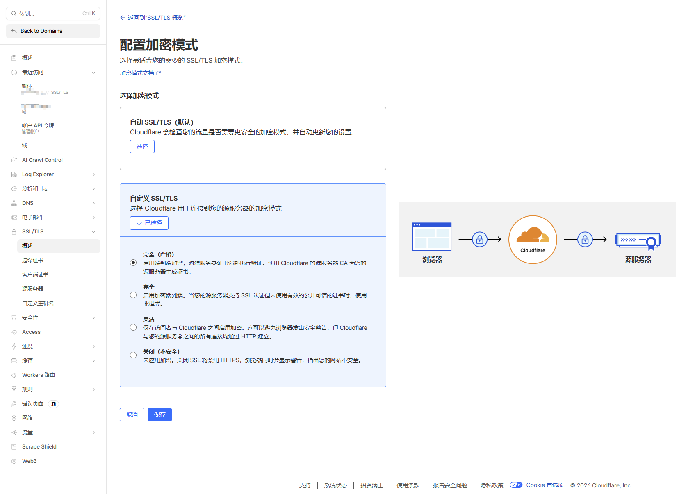
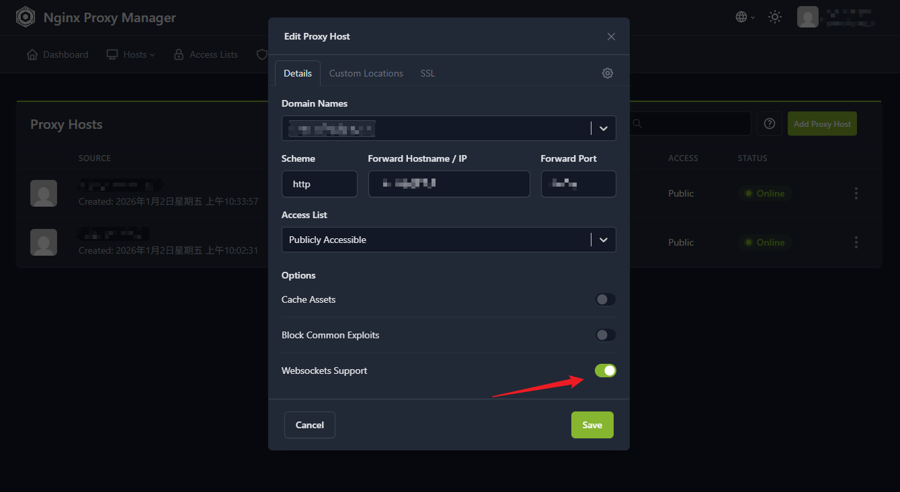

### 概述

刚刚折腾完，分享一下部署探针踩的坑。 我的探针服务采用的是 **Komari**，反代通过 **NPM (Nginx Proxy Manager)** 解决，整体使用 Docker Compose 进行管理。

### 1.开启 NPM 强制 SSL 后页面无法访问？

申请完证书并开启 Nginx 的“**强制 SSL**”后，无法通过 HTTPS 正常访问。排查发现原因在于 **Cloudflare 的 SSL 模式默认为“Flexible（灵活）”**。

当用户通过域名访问网页时，请求先到达 Cloudflare，再转发给源服务器。由于 Cloudflare 在“Flexible”模式下默认向源服务器发送 **HTTP** 请求，而我的 Nginx 配置了强制 **HTTPS**，导致服务器不断返回 **301 重定向** 给 Cloudflare，从而引发了“重定向次数过多”的循环报错。

#### **解决方法：**

在 Cloudflare 的 SSL/TLS 设置中，将加密模式从默认的 **“灵活 (Flexible)”** 修改为 **“完全（严格） / Full (Strict)”**。

### 2.Komari Agent HTTPS 连接后设备显示离线

在接入探针时，我**发现**使用 HTTP 可以成功连接，但换成 HTTPS 后设备一直显示‘离线’。排查后发现，根本原因是 Komari 的实时数据传输依赖 **WebSocket** 协议，但 Nginx 默认没有开启对 WebSocket 的**协议升级（Upgrade）**支持，导致连接在握手阶段被拦截。”

#### **解决方法：** 

在 Nginx Proxy Manager (NPM) 的后台编辑该代理主机 (Proxy Host)，直接勾选 **WebSockets Support** 选项即可。

