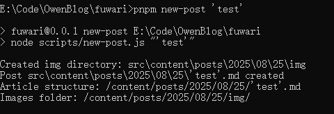

## 文章前言
> 本片文章主要对了在部署完成 Fuwari 静态博客后可能会遇到的问题做一个简单的解答，比如：怎样在本地启动开发环境，如何发布一篇文章，对于文章中前置数据块的解释等。有关于 Fuwari 博客详细的部署教程会在后续更新。

## 0x01-在本地启动运行环境

> 首先你要确保本机已安装 `node.js`环境，在将 `cmd`命令行的目录移动到存放博客源码的位置，输入后续内容。

```cmd
# 如果为构建以来需要构建
pnpm install

# 启动运行环境
pnpm dev
```

## 0x02-创建文章

> 同样，需要将 `cmd` 命令行目录移动到存放博客源码的位置

```cmd
pnpm new-post '文章标题'
```



## 0x03-文章的存放路径

> md文件应放置在`src/content/posts/`目录中。也可以创建子目录，以便更好地组织您的帖子和资源。这里我修改了一下脚本源码，创建的新文章存放的目录会更具真实日期创建 (2025\08\25)

```
src/content/posts/
├── post-1.md
└── post-2/
    ├── cover.png
    └── index.md
```

## 0x04-文章前置数据块的解释

>  使用脚本创建文章后，每篇文章会自带以下标签，我称它为前置数据块的解释(Front Matter)

在静态博客生成器（例如 Astro、Hugo、Hexo、Jekyll 等）里，Front Matter 通常放在 Markdown 文件头部，用三条短横线 `---` 包裹，主要作用是为文章提供元数据（metadata）。这些元数据不会直接显示在正文里，但会被博客系统读取，用来生成页面、列表、SEO 信息等。

```yaml
---
title: My First Blog Post
published: 2023-09-09
description: This is the first post of my new Astro blog.
image: ./cover.jpg
tags: [Foo, Bar]
category: Front-end
draft: false
---
```

| 属性 | 描述 |
|---------------|--------------------------------------------------------------------------------------------------------------------------------------------------------------------------------------------|
| `title` | 文章标题 |
| `published` | 文章发布日期 |
| `description` | 文章简介，显示在首页 |
| `image` | 文章封面图片路径。<br/>1. 以 `http://` 或 `https://` 开头：使用网页图片<br/>2. 以 `/` 开头：用于 `public` 目录中的图片<br/>3. 不带任何前缀：相对于 markdown 文件 |
| `tags` | 文章标签 |
| `category` | 文章分类 |
| `draft` | 如果文章仍为草稿，则不会显示（false：显示/true：不显示）|

