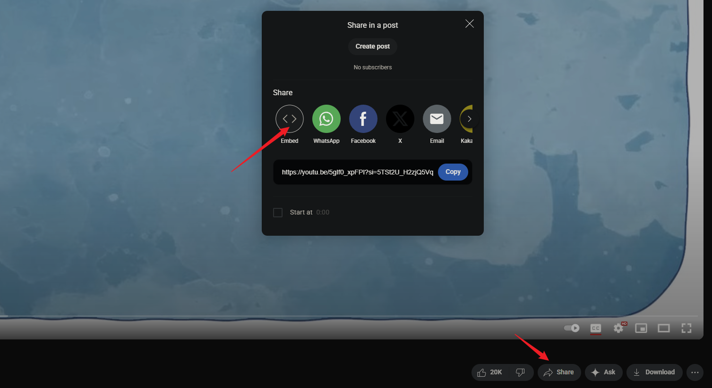

只需从 YouTube 或 Bilibili 等平台复制嵌入代码，然后粘贴到 Markdown 文件中即可。




复制下来的宽高可能不太适合博客页面，可以自定义一些宽高：

```html
<iframe width="100%" height="468" src="https://www.youtube.com/embed/5gIf0_xpFPI?si=N1WTorLKL0uwLsU_" title="YouTube video player" frameborder="0" allowfullscreen></iframe>
```


## YouTube

<iframe width="100%" height="468" src="https://www.youtube.com/embed/5gIf0_xpFPI?si=5TSt2U_H2zjQ5VqY" title="YouTube video player" frameborder="0" allow="accelerometer; autoplay; clipboard-write; encrypted-media; gyroscope; picture-in-picture; web-share" referrerpolicy="strict-origin-when-cross-origin" allowfullscreen></iframe>

## Bilibili

<iframe width="100%" height="468" src="//player.bilibili.com/player.html?isOutside=true&aid=43426592&bvid=BV1Jb411U7u2&cid=76113255&p=1" scrolling="no" border="0" frameborder="no" framespacing="0" allowfullscreen="true"></iframe>

